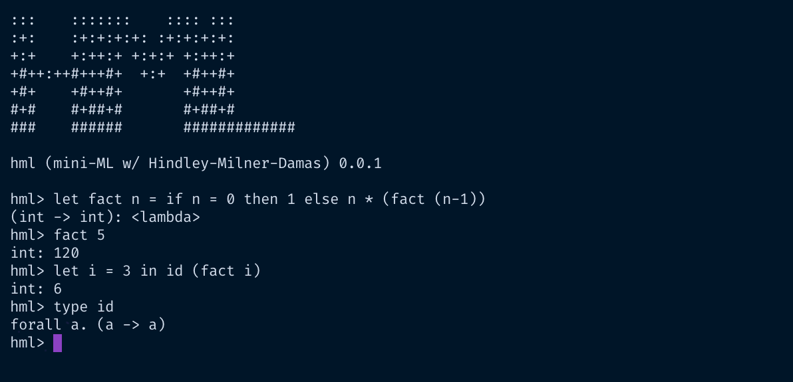

# HML
A mini ML implementation with Hindley-Milner-Damas type inference. Hindley-Milner-Damas is type inference algorithm for a restricted System-F / Polymorphic Lambda Calculus. The language has Lambdas, Let-Bindings(with parametric polymorphism), Pairs etc.

## REPL

